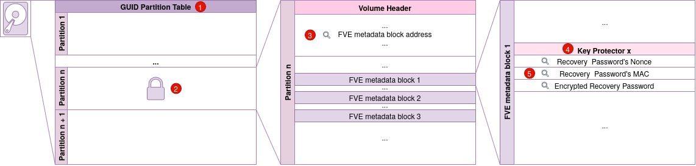

# vmk2rk
A tool developped with anything but a brain. You could use it to retrieve a BitLocker Recovery Password by providing a VMK and the targeted filesystem.

## Usage
Start by building it : 
```bash
cargo build -r 
```
Then simply provide a `VMK` and a `block/disk image file path` or a `nonce`, a `MAC` and a `paylaod`. 
```
Usage: vmk2rk [OPTIONS] --vmk <Key>

Options:
  -v, --vmk <Key>
          VMK, key used to decrypt the Recovery Password
  -n, --nonce <Nonce>
          Nonce used to decrypt the Recovery Password
  -m, --mac <MAC>
          MAC used to decrypt the Recovery Password
  -p, --payload <Payload>
          Payload containing the encrypted Recovery Password
  -d, --disk <DISKPATH>
          Disk to retrieve the nonce, MAC and encrypted Recovery Password
  -h, --help
          Print help (see a summary with '-h')
  -V, --version
          Print version
```

## How it works

If the VMK, nonce, MAC and payloed or provided when executing `vmk2rk`, it will proceed with decryption. However, if a block file or a disk image is provided, it will try to retrieve the Recovery Password's nonce, MAC and  encrypted form :
1. The binary will read the GUID Partition Table (gpt) to retrieve the start address for each partition
2. It will try to identify the first encrypted partition
3. If found, it will read the volume header to retrieve the FVE metadata blocks addresses
4. The tool will then parse the key protectors and identify the one holding the encrypted recovery password
5. The nonce, MAC and encrypted recovery password will be extracted and passed to the decryption function

The decryption process is as follows: 
- The payload is decrypted using AES-256-CCM
- The header describing the recovery password is removed and the rest is split into 8 2 bytes words
- The endianess for each word is swapped
- The words are then multiplied by `0x0b`
- The words are transformed into integers and displayed with `-` as separators

## Dependencies 
- [clap](https://docs.rs/clap/latest/clap/)
- [aes](https://docs.rs/aes/latest/aes/)
- [ccm](https://docs.rs/ccm/latest/ccm/)
- [gpt](https://docs.rs/gpt/latest/gpt/)
- [itertools](https://docs.rs/itertools/latest/itertools/)

## Sources
- Idea is coming from [@pascal-gujer](https://github.com/pascal-gujer) who raised an [issue](https://github.com/Aorimn/dislocker/issues/294) on the [dislocker](https://github.com/Aorimn/dislocker) project.
- [Implementing BitLocker Drive Encryption for forensic analysis](https://pdf4pro.com/cdn/implementing-bitlocker-drive-encryption-for-19a515.pdf) by Jesse D. Kornblum 
- [libbde](https://github.com/libyal/libbde/blob/main/documentation/BitLocker%20Drive%20Encryption%20%28BDE%29%20format.asciidoc)
